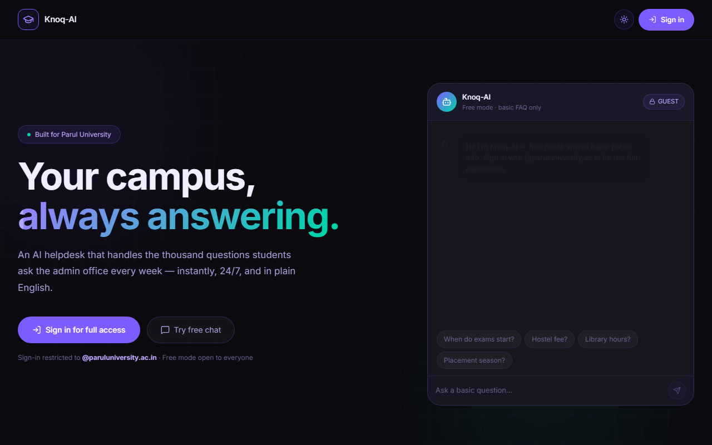
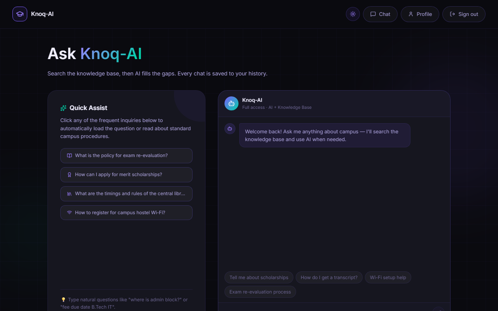
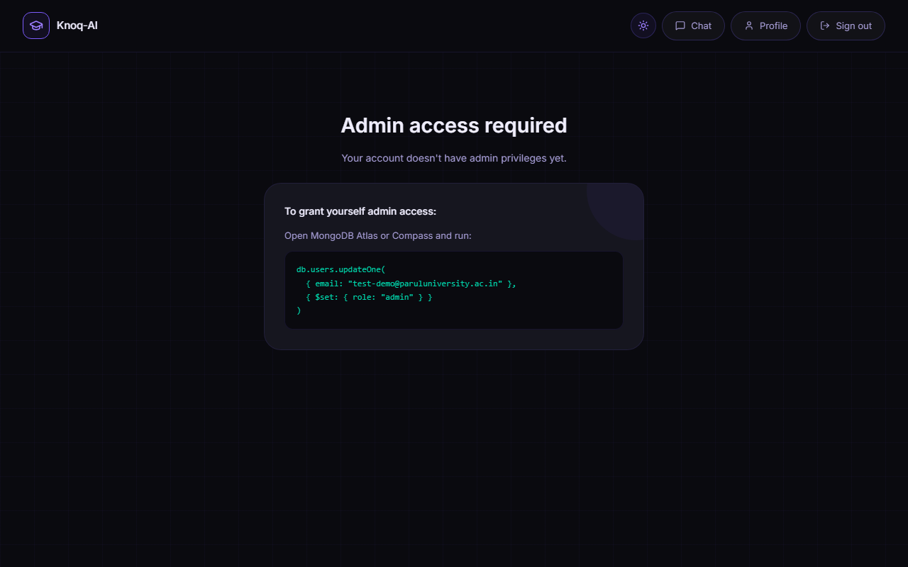
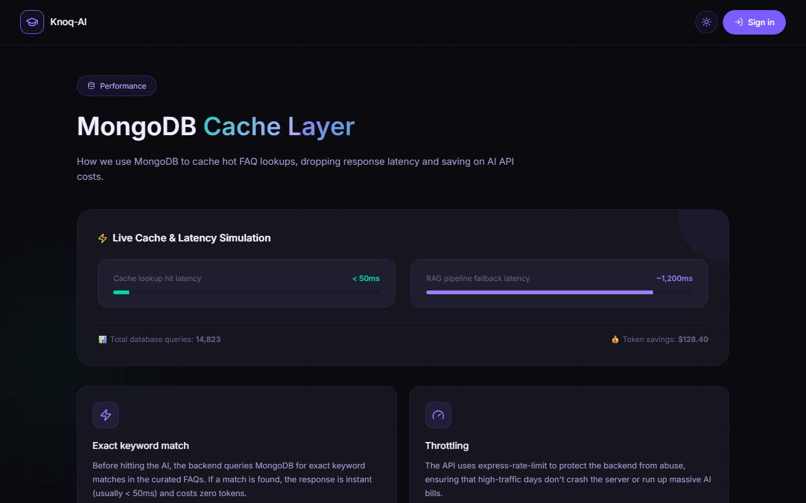
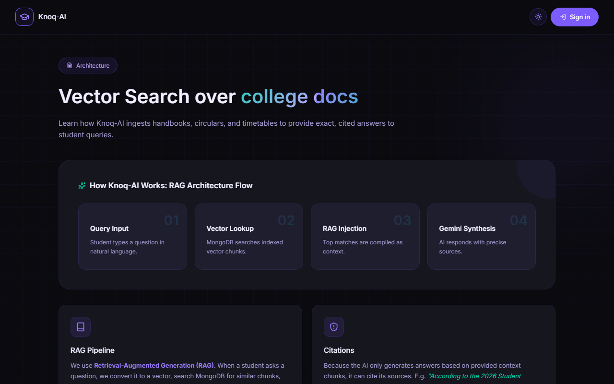
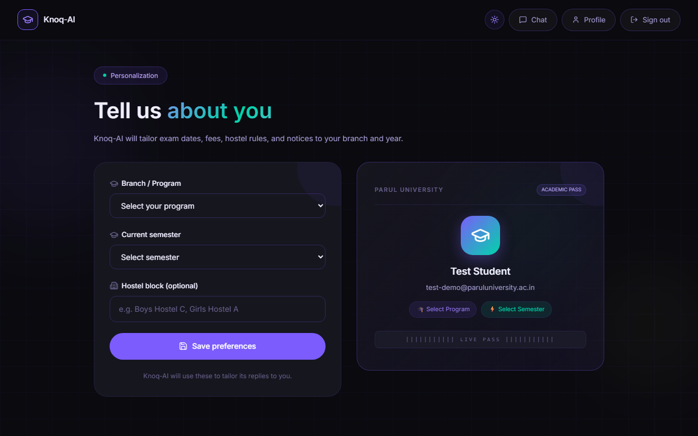
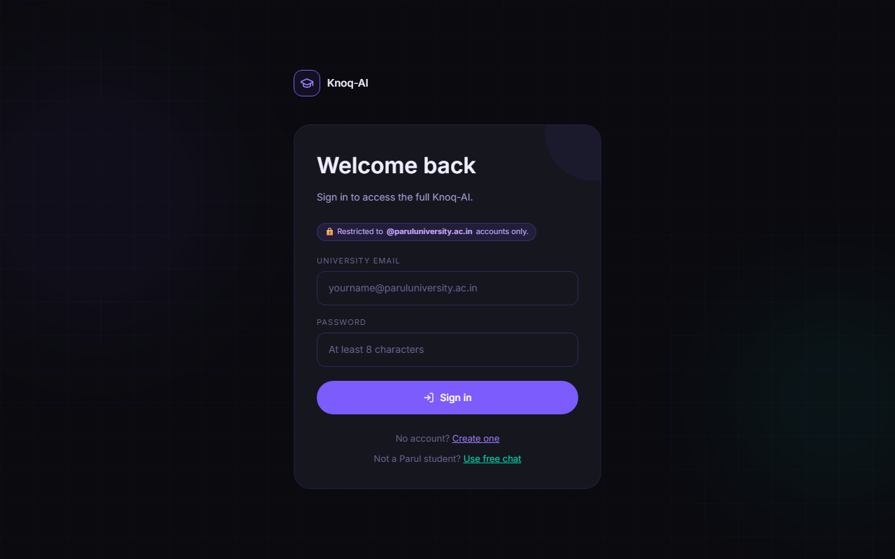
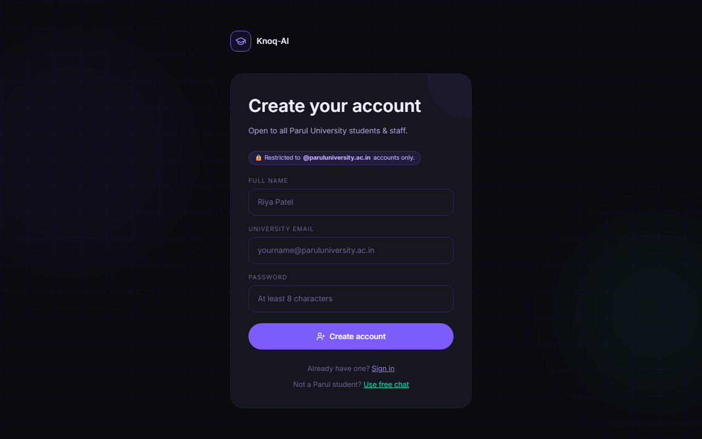

# Knoq-AI - Parul University AI Helpdesk

A complete MERN stack migration from a Lovable/TanStack Start architecture.

## Overview
Knoq-AI is an AI-powered helpdesk for Parul University students. It features a two-tier chat system:
- **Free Mode**: Guest access for basic curated FAQs.
- **Full Mode**: `@paruluniversity.ac.in` verified access with personal chat history, profile personalization, and AI RAG (Retrieval-Augmented Generation) using Google Gemini.

## Tech Stack
- **Frontend**: React 19, Vite, TailwindCSS v4, React Router v7
- **Backend**: Node.js, Express.js, Mongoose, JSON Web Tokens (JWT)
- **Database**: MongoDB Atlas
- **AI Integration**: Google Gemini API (`gemini-2.5-flash` for chat, `text-embedding-004` for RAG)
- **Data Gathering**: Firecrawl API for site scraping

## Getting Started

### 1. Prerequisites
- Node.js (v18+)
- MongoDB Atlas cluster URL
- Google Gemini API Key
- DeepSeek API Key (Optional backup fallback when Gemini experiences high demand/503 errors)
- Firecrawl API Key (optional, for admin crawling)

### 2. Installation
```bash
npm install
npm run install:all
```

### 3. Environment Variables
Copy `.env.example` to `backend/.env` and fill in your keys:
```
PORT=5000
MONGODB_URI=mongodb+srv://...
JWT_SECRET=your_super_secret_jwt_key
GEMINI_API_KEY=your_gemini_key
DEEPSEEK_API_KEY=your_deepseek_key_here
GOOGLE_MAPS_API_KEY=your_google_maps_key_here
FIRECRAWL_API_KEY=your_firecrawl_key
```

### 4. Running the application
```bash
# Starts both frontend and backend concurrently
npm run dev
```

Frontend will run at `http://localhost:5173`
Backend API will run at `http://localhost:5000`

### 5. Data Migration (Optional)
If you are migrating from the old Supabase PostgreSQL database:
1. Ensure `DATABASE_URL` (Supabase connection string) is set in your environment.
2. Run `node scripts/migrate-data.js` to transfer users, FAQs, chat logs, and vector embeddings to MongoDB.

## Webpage Screenshots

### 🏠 Landing Page
Beautiful, modern dark-themed landing page showcasing Knoq-AI.


### 💬 Student Chat Dashboard
Full-featured chat dashboard where students query AI and get instant responses with citation cards, standard templates, and maps.


### 🛠️ Admin Panel & Web Crawler
A comprehensive system for crawling university subdomains, viewing crawled vectors, and managing cached FAQs.


### 📈 Performance Cache Dashboard
Visualize cached FAQ lookups dropping latency down to <50ms while saving API token costs.


### 📖 RAG Architecture Flow & Docs
Interactive vector search flow, RAG pipeline explanation, and campus guides.


### 👤 Profile Settings
User personalization settings for Parul University student accounts.


### 🔑 Authentication (Sign In & Sign Up)
Secure login & signup restricted to `@paruluniversity.ac.in` domain accounts.
<table>
  <tr>
    <td></td>
    <td></td>
  </tr>
</table>
