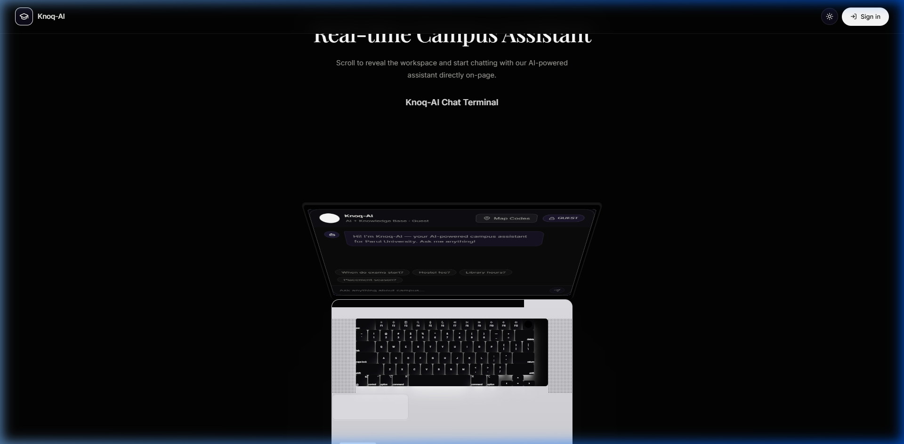
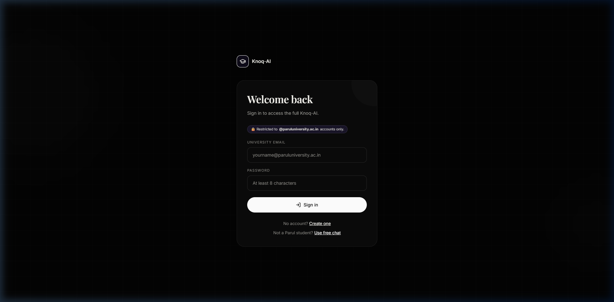
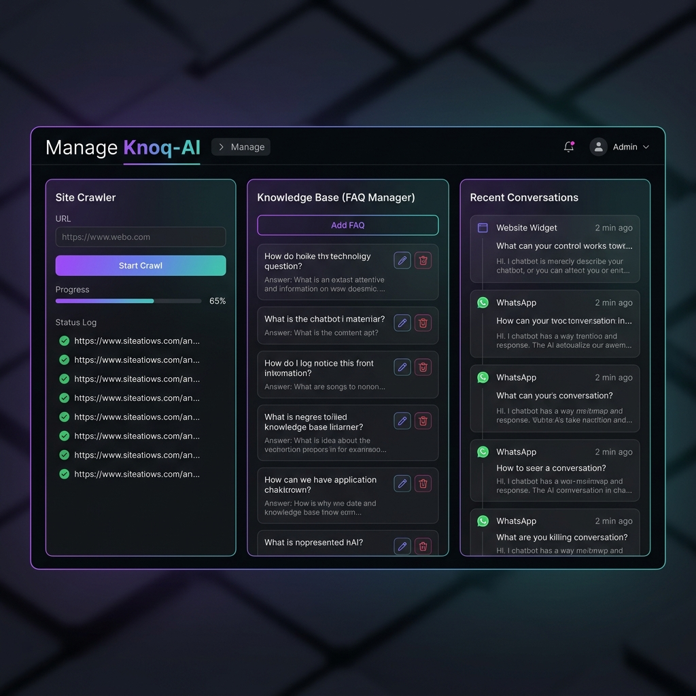
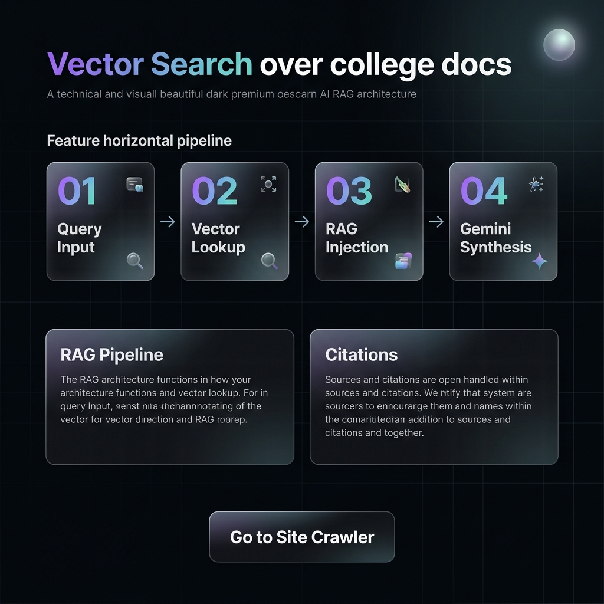
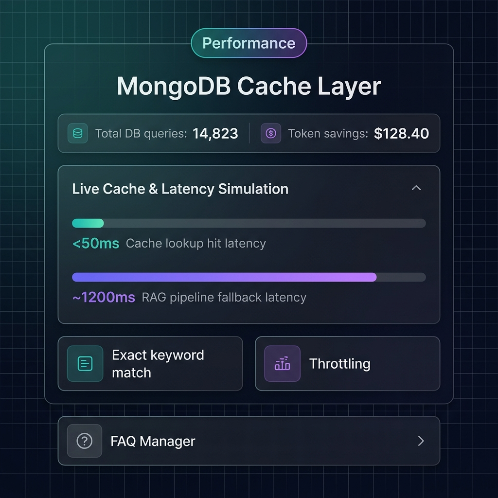
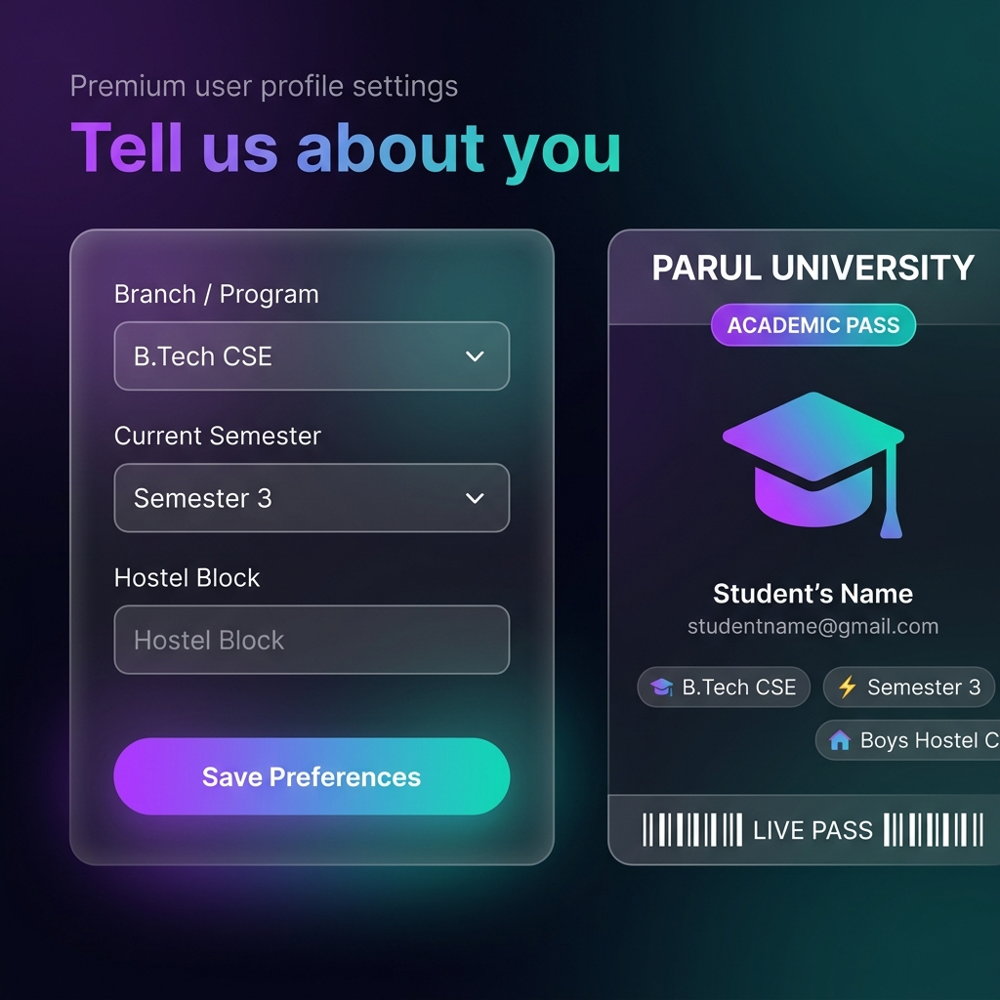
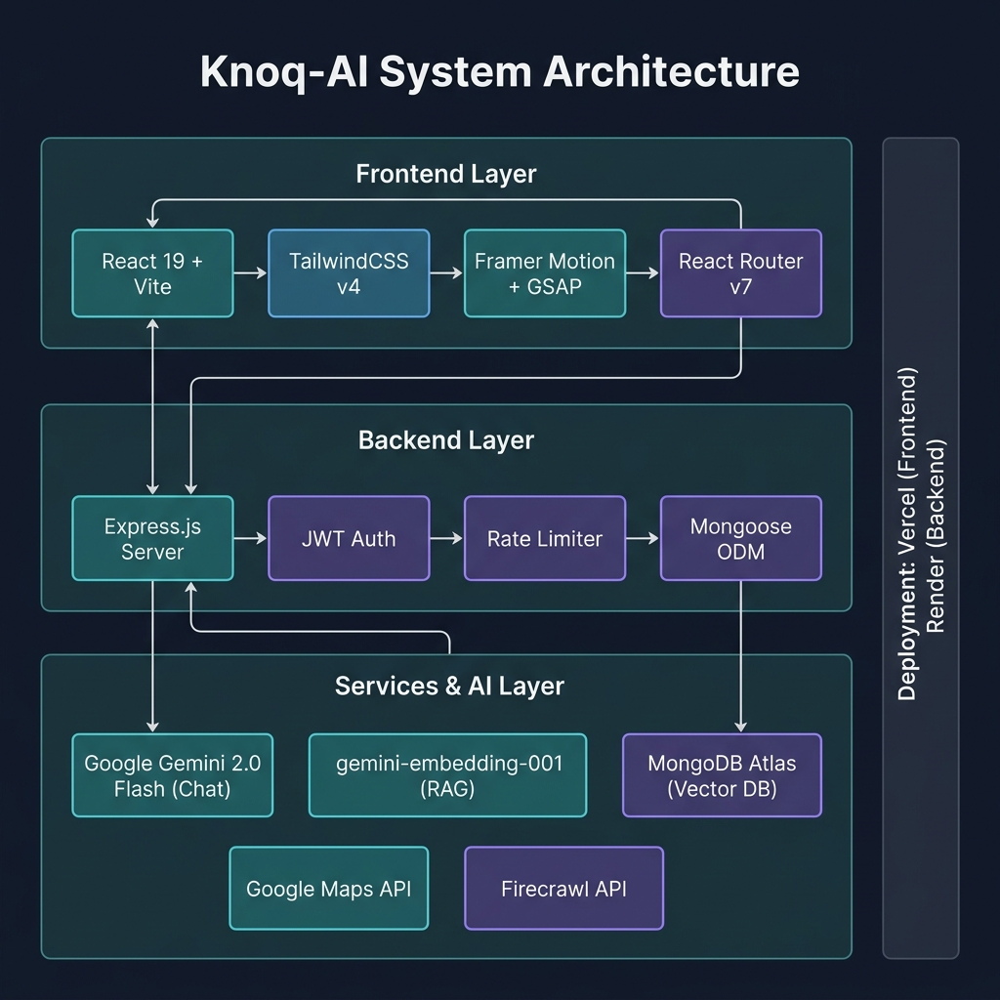

<div align="center">

<h1>🎓 Knoq-AI — Parul University AI Helpdesk</h1>

<p><em>An AI-powered, RAG-driven campus assistant for 40,000+ Parul University students.</em></p>

<p>
  
  
  
  
  
  
</p>

<p>
  
  
</p>

</div>

---

## 📋 Table of Contents

1. [Overview](#-overview)
2. [Live Demo & Screenshots](#-live-demo--screenshots)
   - [🏠 Landing Page (Home)](#-landing-page--home)
   - [💬 AI Chat Dashboard](#-ai-chat-dashboard)
   - [🛡️ Authentication](#️-authentication--login--signup)
   - [🛠️ Admin Panel](#️-admin-panel)
   - [📖 RAG Architecture & Docs](#-rag-architecture--docs)
   - [📈 Cache Performance Dashboard](#-cache-performance-dashboard)
   - [👤 Profile Personalization](#-profile-personalization)
3. [System Architecture](#-system-architecture)
4. [Tech Stack](#-tech-stack)
5. [Project Structure](#-project-structure)
6. [Features Deep-Dive](#-features-deep-dive)
7. [Getting Started](#-getting-started)
8. [Environment Variables](#-environment-variables)
9. [API Reference](#-api-reference)
10. [Data Pipeline](#-data-pipeline)
11. [Deployment](#-deployment)
12. [Contributing](#-contributing)

---

## 🌟 Overview

**Knoq-AI** is a full-stack MERN (MongoDB, Express, React, Node.js) AI helpdesk built specifically for **Parul University**. It handles the thousands of daily queries students ask the admin office — _instantly_, _24/7_, and _in plain English_.

### Access Tiers

| Feature | 🔓 Free Mode (Guest) | 🔐 Full Mode (Verified) |
|---|---|---|
| Access | Anyone | `@paruluniversity.ac.in` only |
| FAQs | Curated, basic | Full knowledge base |
| AI Generation | ❌ | ✅ Gemini RAG |
| Chat History | ❌ | ✅ Persistent |
| Profile Personalization | ❌ | ✅ Branch / Semester |
| Admin Controls | ❌ | ✅ (role-based) |

### Key Metrics

| Metric | Value |
|---|---|
| 🚀 Cache Hit Latency | < 50ms |
| 🤖 AI Response Latency | ~1,200ms |
| 📚 Questions Indexed | 10,000+ |
| 💰 Token Savings (cached) | $128+ |
| 🔑 Multi-key Rotation | Up to 3 Gemini API keys |

---

## 🖼️ Live Demo & Screenshots

> All screenshots below represent actual UI pages rendered by the application.

---

### 🏠 Landing Page · Home

The editorial dark-mode landing page with a GSAP-animated hero, 3D interactive torus-knot, MacBook scroll reveal with live free-mode chat panel, stats cards, and access tier comparison.


**DOM Sections on `/`:**
| ID | Component | Description |
|---|---|---|
| `#hero` | `<section id="hero">` | GSAP animated h1, 3D `<Interactive3D />`, CTA buttons |
| `#platform-scroll` | `<MacbookScroll>` | Scroll-reveal Macbook with embedded `<ChatPanel mode="free">` |
| `#stats` | Page-fold cards | `< 50ms`, `10,000+`, `Gemini RAG` performance stats |
| `#tiers` | Motion cards | Free vs. Verified access tier comparison |
| `#roadmap` | `<CardSpotlight>` | 3-step "How It Works": Verification → RAG → Campus Response |
| `#faq` | Accordion | Frequently asked questions expand/collapse |
| `<footer>` | Footer | Nav links, social, copyright |

---

### 💬 AI Chat Dashboard

The core product experience on `/app`. Full-mode users get Gemini-powered RAG responses with source citations. Free-mode users get curated FAQ lookups.



**DOM Structure on `/app`:**
| Element | Component | Description |
|---|---|---|
| Top bar | `<Nav />` | Logo, navigation links, user avatar, dark-mode toggle |
| Chat history | `<ChatPanel />` | Scrollable message thread with bubbles |
| User message | `.msg-user` | Right-aligned pill |
| AI response | `.msg-ai` | Left-aligned with glassmorphism card |
| Citation cards | `.citation-chip` | Source tags (Handbook, Campus Routes, etc.) |
| Input area | `<form>` in `<ChatPanel>` | Textarea + Send button + Sparkle icon |
| Mode badge | `.mode-badge` | "FREE MODE" or "FULL MODE" indicator |

---

### 🛡️ Authentication · Login & Signup

Secure email/password authentication restricted to `@paruluniversity.ac.in` domain. JWT tokens stored in memory with secure HTTP-only flow.



**DOM Structure on `/login` & `/signup`:**
| Route | Component | Key Fields |
|---|---|---|
| `/login` | `<AuthForm mode="login">` | Email, Password, "Sign in" CTA |
| `/signup` | `<AuthForm mode="signup">` | Full Name, Email, Password, Confirm Password |
| Validation | Client + Server | Domain check `@paruluniversity.ac.in`, bcrypt hash |
| Token | JWT | 7-day expiry, stored in `AuthContext` |

---

### 🛠️ Admin Panel

Role-protected dashboard at `/admin` for managing the entire knowledge base, web crawler, brochure uploads, FAQ CRUD, and viewing conversation logs.



**DOM Sections on `/admin`:**
| Panel | Component | Description |
|---|---|---|
| Site Crawler | `<SiteCrawler />` | URL input → Firecrawl → extract FAQs → embed vectors |
| Brochure Manager | `<BrochureManager />` | Drag-and-drop PDF upload, parse pages, generate embeddings |
| Knowledge Base | `<FAQManager />` | CRUD for curated FAQs with keyword + category tagging |
| Conversation Logs | `<ChatLogs />` | Recent Q&A pairs with source + timestamp |
| Access Control | `useAuth()` | Role `admin` required; shows setup guide for non-admins |

**Grant Admin Access (MongoDB):**
```js
db.users.updateOne({ email: "your@paruluniversity.ac.in" }, { $set: { role: "admin" } })
```

---

### 📖 RAG Architecture & Docs

The `/docs` page explains the full Retrieval-Augmented Generation pipeline with an interactive 4-step flow diagram.



**RAG Pipeline Flow:**
```
Student Query
     │
     ▼
[01] Query Input ──► Convert to 768-dim vector embedding (gemini-embedding-001)
     │
     ▼
[02] Vector Lookup ──► MongoDB $vectorSearch on ScrapedPage / BrochurePage collections
     │
     ▼
[03] RAG Injection ──► Top-k chunks compiled as system context
     │
     ▼
[04] Gemini Synthesis ──► gemini-2.0-flash generates grounded response + citations
```

**DOM Structure on `/docs`:**
| Element | Purpose |
|---|---|
| Pipeline diagram | 4 glassmorphism step-cards in a flex row |
| RAG Pipeline card | `.feat-card` — explains embedding strategy |
| Citations card | `.feat-card` — explains source attribution |
| CTA | Link to `/admin` Site Crawler |

---

### 📈 Cache Performance Dashboard

The `/cache` page visualizes the two-tier response system: exact keyword cache (< 50ms) vs. AI RAG fallback (~1,200ms).



**Cache Strategy:**
```
Incoming Query
      │
      ├─► [Tier 1] MongoDB keyword match on FAQ collection
      │           └── HIT → Return instantly (<50ms), zero tokens
      │
      └─► [Tier 2] Vector similarity search + Gemini generation
                  └── MISS → Full RAG pipeline (~1,200ms)
```

**DOM Structure on `/cache`:**
| Element | Description |
|---|---|
| Latency bar chart | Two `<div>` progress bars: teal (50ms) and violet (1200ms) |
| Stats row | Total DB queries + Token savings |
| "Exact keyword match" card | Explains Tier-1 cache |
| "Throttling" card | Explains `express-rate-limit` protection |
| CTA | Link to `/admin` FAQ Manager |

---

### 👤 Profile Personalization

The `/profile` page lets verified students set their academic context (branch, semester, hostel) which Knoq-AI uses to tailor responses. Features a live academic ID card mockup.



**DOM Structure on `/profile`:**
| Element | Description |
|---|---|
| Form card | Branch dropdown, Semester dropdown, Hostel text input |
| Save button | `btn-glow` with loading + saved state |
| Academic ID card | Live preview updating as user fills form |
| Chips | `🎓 Branch`, `⚡ Semester`, `🏠 Hostel` badges |
| Barcode mock | `||||||||||| LIVE PASS |||||||||||` monospace strip |

---

## 🏗️ System Architecture



```
┌─────────────────────────────────────────────────────────────────────┐
│                        FRONTEND (Vercel)                            │
│  React 19 · Vite 8 · TailwindCSS v4 · Framer Motion · GSAP · Three.js │
│                                                                     │
│  Pages: / · /login · /signup · /app · /admin · /profile · /docs · /cache │
└──────────────────────────────┬──────────────────────────────────────┘
                               │ HTTPS / JWT Bearer
┌──────────────────────────────▼──────────────────────────────────────┐
│                        BACKEND (Render)                             │
│  Node.js 18+ · Express.js · Helmet · express-rate-limit            │
│                                                                     │
│  Routes:                                                            │
│  POST /api/auth/register · /api/auth/login                         │
│  GET/POST/PUT/DELETE /api/faqs                                      │
│  POST /api/chat                                                     │
│  GET /api/profile · POST /api/profile                              │
│  POST /api/crawl/start                                              │
│  GET /api/admin/chat-logs · /api/admin/brochure                    │
│  POST /api/admin/brochure/upload                                    │
└────────┬──────────────────────────────────┬────────────────────────┘
         │                                  │
┌────────▼────────┐              ┌──────────▼──────────────────────────┐
│  MongoDB Atlas  │              │        External AI Services          │
│                 │              │                                      │
│  Collections:   │              │  Google Gemini API                   │
│  • users        │              │  ├── gemini-2.0-flash (chat)         │
│  • faqs         │              │  ├── gemini-2.5-flash (FAQ extract)  │
│  • chatlogs     │              │  └── gemini-embedding-001 (vectors)  │
│  • scrapedpages │              │                                      │
│  • brochurepages│              │  DeepSeek API (fallback)             │
│  • campusroutes │              │  Google Maps API (campus nav)        │
│  • mapcache     │              │  Firecrawl API (web crawling)        │
│  • semanticcache│              └──────────────────────────────────────┘
│  • crawljobs    │
└─────────────────┘
```

---

## 🛠️ Tech Stack

### Frontend
| Technology | Version | Purpose |
|---|---|---|
| React | 19.x | UI framework |
| Vite | 8.x | Build tool + Dev server |
| TailwindCSS | v4 | Utility-first styling |
| Framer Motion | 12.x | Declarative animations |
| GSAP | 3.x | High-performance hero animations |
| Three.js | 0.184 | 3D torus-knot in hero |
| React Router | v7 | Client-side routing |
| Axios | 1.x | HTTP client |
| Lucide React | 1.x | Icon library |
| @tabler/icons-react | 3.x | Additional icons |

### Backend
| Technology | Version | Purpose |
|---|---|---|
| Node.js | 18+ | Runtime |
| Express.js | 4.x | HTTP server + routing |
| Mongoose | 8.x | MongoDB ODM |
| JWT (jsonwebtoken) | 9.x | Authentication tokens |
| bcryptjs | 2.x | Password hashing |
| Helmet | 8.x | Security headers |
| express-rate-limit | 7.x | API rate limiting |
| Multer | 2.x | PDF file uploads |
| pdf-parse | 2.x | PDF text extraction |
| csv-parser | 3.x | Campus dataset ingestion |
| xlsx | 0.18 | Excel dataset parsing |
| Zod | 3.x | Schema validation |

### AI & External Services
| Service | Usage |
|---|---|
| Google Gemini `gemini-2.0-flash` | Chat completions (primary) |
| Google Gemini `gemini-2.5-flash` | FAQ extraction from crawled pages |
| Google Gemini `gemini-embedding-001` | 768-dim vector embeddings for RAG |
| DeepSeek API | Fallback AI when Gemini hits quota |
| MongoDB Atlas Vector Search | Semantic similarity search |
| Google Maps API | Campus navigation + location data |
| Firecrawl API | University subdomain web crawling |

---

## 📁 Project Structure

```
future-vision-hub/
├── 📄 package.json                    # Root: concurrently scripts
├── 📄 .env.example                    # Environment variables template
├── 📄 PU_Campus_Navigation_Dataset_v3_verified.csv
├── 📄 Parul_University_Complete_Datasheet_2026-27.xlsx
│
├── 📂 frontend/                       # React + Vite SPA
│   ├── 📄 vite.config.js              # Vite + TailwindCSS v4 config
│   ├── 📄 index.html                  # Entry HTML
│   └── 📂 src/
│       ├── 📄 main.jsx                # React DOM root
│       ├── 📄 App.jsx                 # Router + Context providers
│       ├── 📄 index.css              # Global design tokens + utilities
│       ├── 📂 pages/
│       │   ├── 📄 Home.jsx            # Landing page (GSAP + 3D + sections)
│       │   ├── 📄 AppChat.jsx         # Main chat application page
│       │   ├── 📄 Login.jsx           # Login route wrapper
│       │   ├── 📄 Signup.jsx          # Signup route wrapper
│       │   ├── 📄 Admin.jsx           # Admin dashboard (role-gated)
│       │   ├── 📄 Profile.jsx         # Student personalization
│       │   ├── 📄 Docs.jsx            # RAG architecture docs
│       │   └── 📄 Cache.jsx           # Performance cache docs
│       ├── 📂 components/
│       │   ├── 📄 Nav.jsx             # Responsive navigation bar
│       │   ├── 📄 ChatPanel.jsx       # Chat UI with free/full mode
│       │   ├── 📄 AuthForm.jsx        # Shared login/signup form
│       │   ├── 📄 Interactive3D.jsx   # Three.js torus-knot hero
│       │   ├── 📄 SiteCrawler.jsx     # Admin web crawler UI
│       │   └── 📂 ui/
│       │       ├── 📄 macbook-scroll.jsx  # Aceternity MacBook scroll
│       │       └── 📄 card-spotlight.jsx  # Interactive spotlight card
│       ├── 📂 contexts/
│       │   ├── 📄 AuthContext.jsx     # JWT auth state + helpers
│       │   └── 📄 ThemeContext.jsx    # Dark/light mode toggle
│       ├── 📂 api/
│       │   └── 📄 client.js           # Axios instance with base URL + JWT
│       └── 📂 utils/
│
└── 📂 backend/                        # Express.js API server
    ├── 📄 server.js                   # Entry: Express app + MongoDB connect
    ├── 📄 package.json
    ├── 📂 routes/
    │   ├── 📄 auth.js                 # POST /register, /login
    │   ├── 📄 chat.js                 # POST /chat (RAG pipeline + cache)
    │   ├── 📄 faq.js                  # CRUD /faqs
    │   ├── 📄 profile.js              # GET/POST /profile
    │   ├── 📄 crawl.js                # POST /crawl/start (Firecrawl)
    │   └── 📄 admin.js                # Admin: brochure, chat-logs
    ├── 📂 models/
    │   ├── 📄 User.js                 # User schema (email, role, profile)
    │   ├── 📄 Faq.js                  # FAQ schema (question, keywords, category)
    │   ├── 📄 ChatLog.js              # Chat log schema
    │   ├── 📄 ScrapedPage.js          # Crawled page + vector embeddings
    │   ├── 📄 BrochurePage.js         # PDF page + vector embeddings
    │   ├── 📄 CampusRoute.js          # Campus navigation routes
    │   ├── 📄 MapCache.js             # Google Maps response cache
    │   ├── 📄 SemanticCache.js        # Semantic query cache
    │   └── 📄 CrawlJob.js             # Crawl job status tracking
    ├── 📂 services/
    │   ├── 📄 gemini.js               # Multi-key Gemini + DeepSeek fallback
    │   ├── 📄 rag.js                  # RAG pipeline (embed + search + inject)
    │   ├── 📄 googleMaps.js           # Maps API + campus route cache
    │   └── 📄 semanticCache.js        # Semantic similarity cache layer
    ├── 📂 middleware/
    │   └── 📄 auth.js                 # JWT verification middleware
    └── 📂 scripts/
        └── 📄 ingestDatasets.js       # CSV/Excel → MongoDB ingestion
```

---

## ✨ Features Deep-Dive

### 🤖 Multi-Key Gemini Rotation
The `gemini.js` service automatically rotates up to **3 Gemini API keys** on rate-limit (429) or quota exhaustion:
```
Key 1 → Key 2 → Key 3 (round-robin on 429)
                     ↓ All exhausted
               DeepSeek Fallback
```

### 🔍 Two-Tier Response Cache
```
Query arrives
  │
  ├─► Tier 1: MongoDB FAQ keyword match → < 50ms, zero tokens
  │
  └─► Tier 2: Vector search → Gemini generation → ~1,200ms
```

### 🗺️ Campus Navigation
The `googleMaps.js` service pre-fetches and caches campus route data (distances, walking times between buildings) in MongoDB `MapCache`, serving navigation responses instantly.

### 🕷️ Site Crawler + Auto-FAQ Extraction
Admins point the crawler at any `paruluniversity.ac.in` subdomain. Firecrawl extracts markdown, Gemini extracts up to 3 student FAQs per page, and embeddings are stored in MongoDB for RAG.

### 📄 PDF Brochure RAG
Admins can upload the university brochure PDF. The system:
1. Parses all pages via `pdf-parse`
2. Generates 768-dim embeddings per page via `gemini-embedding-001`
3. Stores in `BrochurePage` collection
4. Serves as additional RAG context in chat

---

## 🚀 Getting Started

### Prerequisites
- **Node.js** v18+
- **MongoDB Atlas** cluster (free tier works)
- **Google Gemini API Key** (get from [Google AI Studio](https://aistudio.google.com/))
- **Firecrawl API Key** (optional, for admin crawling)
- **DeepSeek API Key** (optional, fallback AI)
- **Google Maps API Key** (optional, for campus navigation)

### Installation

```bash
# 1. Clone the repository
git clone https://github.com/Dhruv4848l/Knoq-AI-Parul-University-HelpDesk-Chat-Bot.git
cd Knoq-AI-Parul-University-HelpDesk-Chat-Bot

# 2. Install all dependencies (root + backend + frontend)
npm install
npm run install:all
```

### Environment Setup

```bash
# Copy the example env file
cp .env.example backend/.env
```

Then edit `backend/.env` with your real keys (see [Environment Variables](#-environment-variables)).

### Run Locally

```bash
# Start both frontend (port 5173) and backend (port 5000) concurrently
npm run dev
```

| Service | URL |
|---|---|
| Frontend | http://localhost:5173 |
| Backend API | http://localhost:5000 |
| API Health | http://localhost:5000/ |

### Seed Data (Optional)

```bash
# Ingest the campus navigation CSV + Excel datasets into MongoDB
cd backend
node scripts/ingestDatasets.js
```

---

## 🔐 Environment Variables

Create `backend/.env` with the following:

```env
# ─── Server ───────────────────────────────────────────
PORT=5000
NODE_ENV=development

# ─── Database ─────────────────────────────────────────
MONGODB_URI=mongodb+srv://<user>:<password>@cluster.mongodb.net/knoq-ai

# ─── Auth ─────────────────────────────────────────────
JWT_SECRET=your_super_secret_64_char_random_string_here

# ─── AI Keys (rotate up to 3 Gemini keys) ─────────────
GEMINI_API_KEY=AIzaSy...key1
GEMINI_API_KEY_2=AIzaSy...key2      # optional
GEMINI_API_KEY_3=AIzaSy...key3      # optional
DEEPSEEK_API_KEY=sk-...             # optional fallback

# ─── External Services ────────────────────────────────
GOOGLE_MAPS_API_KEY=AIzaSy...maps
FIRECRAWL_API_KEY=fc-...

# ─── Production only ──────────────────────────────────
FRONTEND_URL=https://your-app.vercel.app
```

> **💡 Tip:** In production, `FRONTEND_URL` is used for the CORS whitelist. Set it to your Vercel deployment URL.

---

## 📡 API Reference

### Authentication
| Method | Endpoint | Auth | Body | Description |
|---|---|---|---|---|
| POST | `/api/auth/register` | ❌ | `{ name, email, password }` | Register new user |
| POST | `/api/auth/login` | ❌ | `{ email, password }` | Login, returns JWT |

### Chat
| Method | Endpoint | Auth | Body | Description |
|---|---|---|---|---|
| POST | `/api/chat` | ✅ | `{ message, history[] }` | RAG-powered AI response |
| POST | `/api/chat/free` | ❌ | `{ message }` | Free mode FAQ lookup |

### FAQs
| Method | Endpoint | Auth | Description |
|---|---|---|---|
| GET | `/api/faqs` | ❌ | List all curated FAQs |
| POST | `/api/faqs` | ✅ Admin | Create FAQ |
| PUT | `/api/faqs/:id` | ✅ Admin | Update FAQ |
| DELETE | `/api/faqs/:id` | ✅ Admin | Delete FAQ |

### Profile
| Method | Endpoint | Auth | Description |
|---|---|---|---|
| GET | `/api/profile` | ✅ | Get student profile |
| POST | `/api/profile` | ✅ | Save branch/semester/hostel |

### Admin
| Method | Endpoint | Auth | Description |
|---|---|---|---|
| GET | `/api/admin/chat-logs` | ✅ Admin | Recent chat logs |
| GET | `/api/admin/brochure` | ✅ Admin | Active brochure info |
| POST | `/api/admin/brochure/upload` | ✅ Admin | Upload + process PDF |
| DELETE | `/api/admin/brochure` | ✅ Admin | Delete active brochure |

### Crawl
| Method | Endpoint | Auth | Description |
|---|---|---|---|
| POST | `/api/crawl/start` | ✅ Admin | Start site crawl job |

---

## 📊 Data Pipeline

### Campus Navigation Dataset
The `PU_Campus_Navigation_Dataset_v3_verified.csv` (5MB) contains:
- Building names & codes
- Route distances (walking time in minutes)
- Department locations

Run ingestion:
```bash
node backend/scripts/ingestDatasets.js
```

### University Datasheet
`Parul_University_Complete_Datasheet_2026-27.xlsx` contains fee structures, exam dates, hostel policies, and placement stats.

### Web Crawler Flow
```
Admin enters URL → POST /api/crawl/start
                         │
                    Firecrawl API scrapes page
                         │
                    Gemini extracts FAQs (up to 3)
                         │
                    gemini-embedding-001 creates vectors
                         │
                    Stored in MongoDB ScrapedPage
                         │
                    Available for RAG immediately
```

---

## 🌐 Deployment

See [`DEPLOYMENT_ROADMAP.md`](./DEPLOYMENT_ROADMAP.md) for the complete step-by-step guide to deploy:
- **Frontend → Vercel** (free tier)
- **Backend → Render** (free tier)

Quick links:
- [Deploy Frontend to Vercel →](./DEPLOYMENT_ROADMAP.md#-step-1-deploy-backend-to-render)
- [Deploy Backend to Render →](./DEPLOYMENT_ROADMAP.md#-step-2-deploy-frontend-to-vercel)

---

## 🤝 Contributing

1. Fork the repository
2. Create a feature branch: `git checkout -b feature/your-feature`
3. Commit changes: `git commit -m "feat: add your feature"`
4. Push to branch: `git push origin feature/your-feature`
5. Open a Pull Request

---

## 📄 License

MIT License — see [LICENSE](LICENSE) for details.

---

<div align="center">

**Built with ❤️ for Parul University students**

*Knoq-AI · 2026*

</div>
